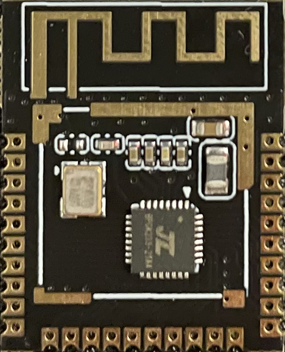
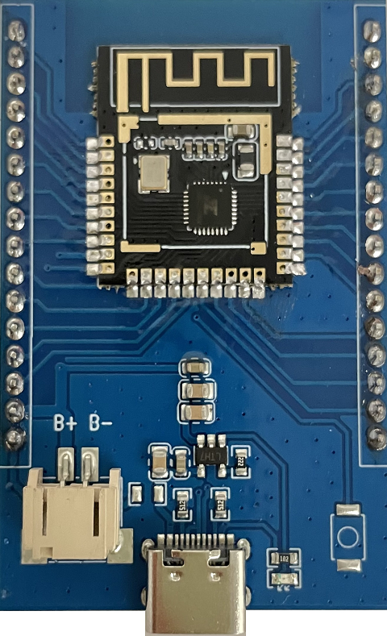

# TKC-Amanita

由太水科技开发的蓝牙模组。该模组核心处理器芯片是一款高集成度的低功耗蓝牙系统级芯片（SoC），芯片集成了 32 位 CPU 支持浮点与数学函数加速运算，并内置蓝牙调制解调器、 基带及模拟 RF 模块，支持蓝牙 V2.1/V4.2/V5.1 版本。

可提供独立模组及调试底板。

规格书: [下载](./TKC-Amanita_Spec.pdf)

原理图: [下载](./TKC-Amanita-1.0_SCH.pdf)

Ticos 开发参考：[参考链接](https://docs.ticos.cn)

芯片开发参考：[参考链接](https://github.com/Jieli-Tech/fw-AC63_BT_SDK)